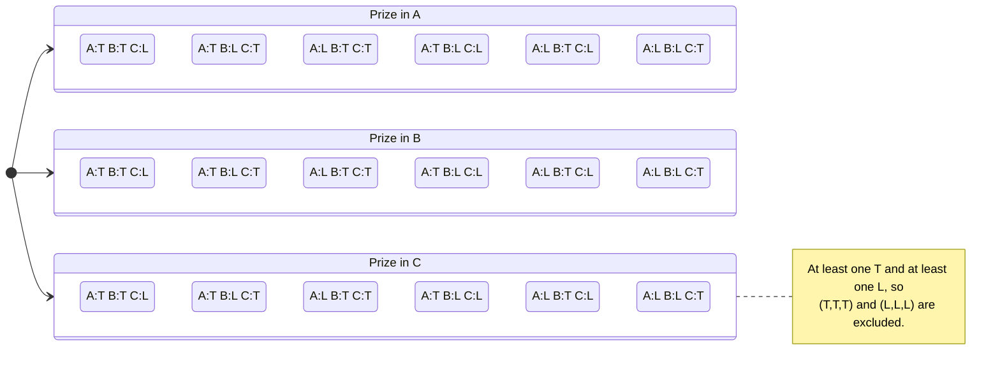

# Blue Prince Box Puzzle Solver

The [Blue Prince](https://en.wikipedia.org/wiki/Blue_Prince) video game contains a room called the Parlor. Within the Parlor is a [logic puzzle](https://blue-prince.fandom.com/wiki/Parlor_Puzzle) wherein, the user may solve a logic puzzle involving three locked chests with notes on them.

The rules as described by the game itself are as follows ([reference](https://static.wikia.nocookie.net/blue-prince/images/e/ef/Parlor_Note.png)):

<table>
  <tbody>
    <tr>
      <td>
        <ul>
          <li>There will always be <b><em>at least one</em> box which displays only true statements.</b></li>
          <li>There will always be <b><em>at least one</em> box which displays only false statements.</b></li>
          <li><b><em>Only one</em> box has a prize</b> within. The <b>other 2 are always empty.</b></li>
        </ul>
      </td>
      <td rowspan="3"></td>
    </tr>
  </tbody>
</table>

With these rules in place, a player is able to surmise through the logical deduction which boxes are lying, telling the truth, and which one contains a prize.

## State space of Parlor puzzle (for three boxes A, B, C)

> _A = Blue, B = White, C = Black_

### Legend

* **Prize ∈ {A, B, C}** — exactly one prize location.
* **T/L assignment** — each of A, B, C is either Truth (T) or Lie (L), subject to: at least one T and at least one L.
* This yields **18 raw worlds** (= 3 prize choices × 6 valid T/L assignments). Later, the specific box statements will prune this set to the actual solution(s).

#### How we’ll use this

1. Start from the 18 worlds above.
2. Add the three actual on-box statements for your specific Parlor instance.
3. Keep only those worlds where each box’s truthfulness matches *all* of its statements (truth-tellers’ statements are all true; liars’ statements are all false).
4. The remaining world(s) give the prize location and which boxes tell the truth vs. lie.

## Plan (state-first, then statements)

### 1) Core state model (fixed and tiny)

Three boxes, colored: **Blue**, **White**, **Black**.

Positions laid out in a line (**Left–Middle–Right**) so “next to this box” is well-defined. (We can make the order configurable; default Blue, White, Black going left→right.)

Each “world” = `(prize: BoxId, roles: Map<BoxId, Role>)`, where `Role ∈ {Truth, Lie}`, with constraints:

- exactly one prize,
- at least one truth-teller and at least one liar.

This gives **18 worlds** to check per puzzle.

---

### 2) Statement representation (no NLP yet)

Instead of parsing free text, each statement is a **templated predicate with parameters**.  
We keep a registry that maps a short ID (like `NEIGHBOR_HAS_GEMS_ANY`) to a function `(world, thisBox) -> Boolean`.  
All examples from the game can be expressed with ~25–40 templates that cover >90% of lines.

---

#### Examples of template “primitives”

* Prize location
  - `PRIZE_IS(box)`
  - `PRIZE_NOT(box)`

* Truth roles
  - `BOX_IS_TRUE(box)`
  - `BOX_IS_FALSE(box)`
  - `COUNT_TRUE == n`
  - `COUNT_FALSE == n`
  - `EXACTLY_ONE_TRUE`
  - `EXACTLY_ONE_FALSE`

* Adjacency (line layout)
  - `NEIGHBOR_HAS_GEMS_ANY` (∃ neighbor with prize)
  - `NEIGHBORS_HAVE_GEMS_BOTH` (∀ neighbors have prize) — only satisfiable if “this box” is middle; implicitly valuable because it often forces falsity on ends

* Emptiness
  - `THIS_BOX_EMPTY`
  - `BOX_EMPTY(box)`
  - `BOTH_EMPTY(a,b)`

* Meta about statements/words (deferable layer)
  - `BOX_WITH_FALSE_STATEMENT_HAS_GEMS_ANY`
  - `ALL_WITH_WORD(word) ARE_FALSE` (e.g., “Every statement with the word ‘black’ is false”)
  - `BOX_WITH_WORD(word) HAS_GEMS` / “statement contains letter …”

* Counterfactual/edit operations (advanced, can come later)
  - “Replace the word ‘every’ with ‘this’ … would be true”

* Uniqueness
  - `THIS_STATEMENT_UNIQUE`
  - `GEMS_NOT_IN_UNIQUE_STATEMENT_BOX`

* Symmetry helpers
  - “This box” vs explicit color (`SELF` vs `Blue/White/Black`)
  - “Other two boxes”

---

## Worked Example (Blue: “There are two false statements”; White: “This is the only true statement”; Black: “The White box is empty”)

We formalize each statement:

- Let $S_B, S_W, S_K$ be the truth values of the Blue, White, and Black statements.
- Let $P_B, P_W, P_K$ represent the prize location (exactly one true).
- Let $T(B), T(W), T(K)$ denote each box’s role (truth-teller or liar).

**Statement definitions:**

1. Blue:

   $$S_B \;\leftrightarrow\; \big( (\lnot S_B) + (\lnot S_W) + (\lnot S_K) = 2 \big)$$

   (“Exactly two statements are false.”)

2. White:

   $$S_W \;\rightarrow\; (\lnot S_B \wedge \lnot S_K)$$

   (“This is the only true statement.”)

4. Black:

   $$S_K \;\leftrightarrow\; \lnot P_W$$

   (“The White box is empty.”)

**Role linkage:**

$$
T(B) \leftrightarrow S_B, \quad
T(W) \leftrightarrow S_W, \quad
T(K) \leftrightarrow S_K
$$

---

**Case analysis:**

- Suppose $S_W = \top$:  
  ⇒ $\lnot S_B \wedge \lnot S_K$  
  ⇒ $S_B = \bot, S_K = \bot$  
  ⇒ But then two statements are false, so $S_B = \top$ (contradiction).  
  ⇒ Therefore $S_W = \bot$.

- With $S_W = \bot$:
    - If $S_B = \top$: then exactly two false ⇒ $\{S_W, S_K\}$.  
      ⇒ $S_K = \bot$.  
      ⇒ $S_K = \lnot P_W$, so $\lnot P_W = \bot$ ⇒ $P_W = \top$.  
      ✅ Consistent.

    - If $S_B = \bot$:
        * If $S_K = \bot$ ⇒ all false (invalid).
        * If $S_K = \top$ ⇒ two false ($S_B, S_W$) ⇒ $S_B = \top$ (contradiction).

Thus the only surviving world is:

$$
S_B = \top, \quad
S_W = \bot, \quad
S_K = \bot, \quad
P_W = \top
$$

---

**Solution:**

- Prize: **White box** ($P_W$)
- Roles: **Blue = Truth-teller**, **White = Liar**, **Black = Liar**
